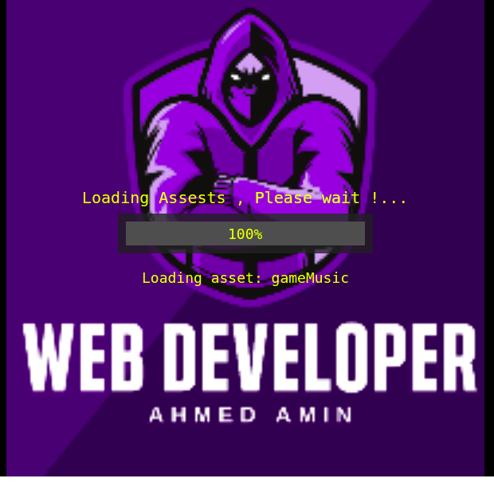
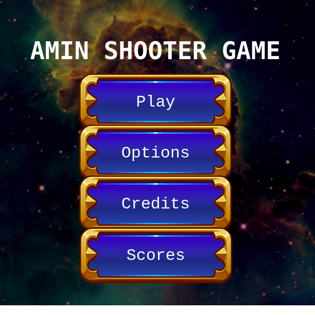
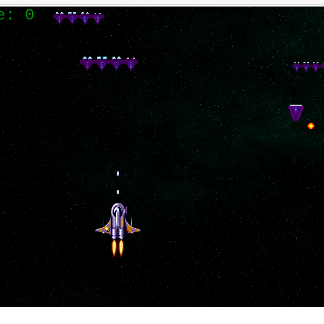
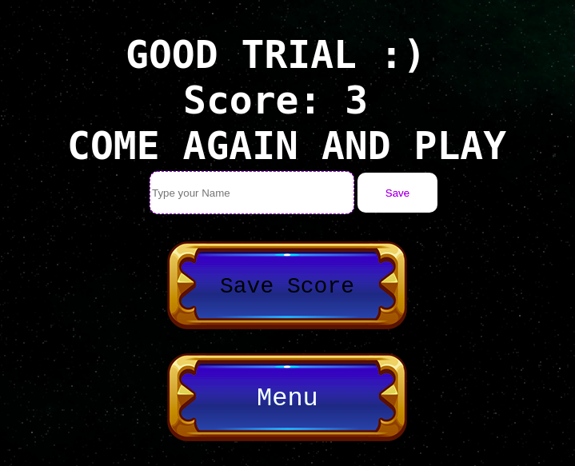
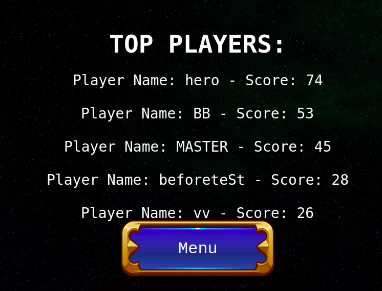

#  Shooter Game.
 
> In this project, I created a web application using JS and Phaser3 framework for a simple shooter game.


- My Objectives at this project to create a simple and easy to use shooter game with basic functions:
    1. Basic and attractive game design.
    2. Basic options that meet the requirements of this game.
    3. Adding score options for the players who want to show up their scores.


# How to play?

1. Firstly you will see the loading scene:

## Loading scene:

 

2. After loading assets, you will find these options, Select the first Button: Play.
## Boot scene:

 

3 You will enter the game, You are the hero and you will fight the enemies (Take care from small enemies :D, they will follow you).
## Game scene:

 

4. Controll buttons: 
    - W for up.
    - S for down.
    - A for left.
    - D for right.
    - Space for fire.


5. You can save your score by click on the Save score button and enter your name.
## Save score scene:

 

6. You can check the top 5 players if you are between them or not by visiting the high score scene:
## Highscore scene:

 


# Live preview :

[Live Link](https://sleepy-dubinsky-6cfc09.netlify.app/)


## Built With
- Javascript.
- HTML,CSS.
- Phaser3 Framework.
- Webpack.
- Jest.
- Deployed to Netlify.

## Test:
- Main testing for scenes and objects.
- Api Test.
 
## Setup

1. To run this project locally, please ensure you have npm installed and the local server plugin in VS code on your machine.
2. Open the terminal.
3. Clone this repository by running:

```bash
git clone https://github.com/AhmedAmin90/shooterGame-Phaser3
```

4. To install the dependencies Open your terminal at the project folder: 

```bash
npm install
```

5. Run the :

```
npm run build
```


6. Open the local server (Open VS code and open your local server ):

7. For Testing:

```
npm run test
```

# Notes:
- I downloaded my assets from https://opengameart.org/.


## Authors

**Ahmed Amin** 
- GitHub: [@AhmedAmin90](https://github.com/AhmedAmin90)
- LinkedIn: [Ahmed Amin](https://www.linkedin.com/in/web-developer/)


## Contribute
Any advice and suggestion for improvement are more than welcome.
Visit [issues' section](https://github.com/AhmedAmin90/shooterGame-Phaser3/issues)

## Show your support
Give a star if you like this project!

## License
<p>This project is <a href="./LICENSE">MIT</a> licensed.</p>